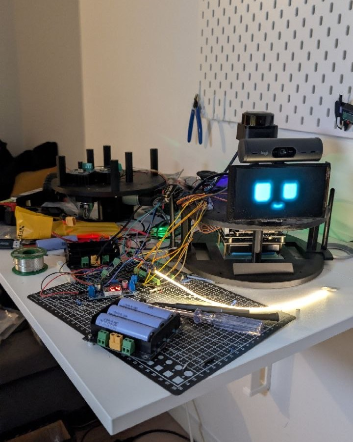

# Gerdoo

> ⚠️ **Work in progress.** Gerdoo does some basic chores around my house. There's still a long way to go.

*Gerdoo* (گردو) means walnut in Persian. Small thing, hard shell, a lot inside. The name felt right.


*Gerdoo, mid-build. A work in progress, like this README.*

## Why I'm building this

I've been building things since my teenage years, when I sold my first piece of software over a dial-up connection, and that itch eventually took me to building technology organizations for more than 10 years, either from 0 → 1 or gradual improvements. Somewhere along the way I realized the software I'd spent my career building lived inside glass rectangles, while the physical world stayed stubbornly manual. Gerdoo is my attempt to fix that: an ambient AI that lives in my house and quietly does the basic chores.

## What Gerdoo can do so far

- **Talks back.** A wake-word listener wakes it, a LiveKit voice agent answers. It picks up mid-sentence when you barge in, does web searches, tells the time, and says goodbye before hanging up.
- **Looks at you.** The neck servo tracks your face during a call.
- **Has a face.** Kiosk face on the 5.5" AMOLED screen, with moods, plus a control panel on the LAN with a live camera stream.
- **Senses the room.** RPLIDAR C1 publishes `/scan` at 10 Hz, and the control panel shows a live LiDAR view.
- **Sets the mood.** Ambient LED strip lighting, dimmable from the Teensy.
- **Has a split brain.** Jetson Orin Nano runs ROS 2, planning, vision and AI. Teensy 4.1 on micro-ROS handles the motors, servos and encoders in real time.
- **Keeps a lab notebook.** 17 logged write-ups of problems, wrong turns, root causes and fixes.

Everything below is working documentation, written for me and for the agents helping me build this as much as for you.

## Where things are

| Path | |
|---|---|
| [`inventory.md`](inventory.md) | **The wiring reference.** Every part, datasheet-backed, with voltage/logic compatibility and the power architecture. Start here |
| [`ACTION-PLAN.md`](ACTION-PLAN.md) | Numbered tasks with dated, measurable pass conditions |
| [`logs/`](logs/README.md) | One file per problem or design decision: evidence, wrong turns, root cause, fix, verification |
| [`teensy_bringup/`](teensy_bringup/) | Minimal health-check firmware + `health_check.py` |
| [`teensy_microros/`](teensy_microros/) | micro-ROS node. Dual Serial, console preserved |
| [`robot-face/`](robot-face/) | Kiosk face on the robot's screen + LAN control panel (mood, camera stream, live LiDAR view) |
| [`voice-agent/`](voice-agent/) | LiveKit voice agent. Runs on the Mac, the Jetson joins the room |
| `PINOUT.md` | ⚠️ **Stale.** The legacy Arduino Nano build. Do not wire from it |
| `motor_controller/`, `encoder_test/`, … | Legacy Nano sketches, kept for reference |

## Architecture

```
Jetson Orin Nano ── ROS 2 Humble ── SLAM, navigation, vision, AI
   │
   ├── USB ── RPLIDAR C1          (own MCU, no co-processor needed)
   ├── USB ── Logitech Brio 500   (control-panel stream)
   ├── HDMI ─ 5.5" AMOLED panel   (kiosk face)
   └── USB ── Teensy 4.1  ── micro-ROS `/teensy_node`
                  │
                  ├── motors via BTS7960, 20 kHz PWM
                  ├── wheel encoders (hardware quadrature)
                  ├── servos via PCA9685 / STS3215
                  └── ultrasonics, lights, weather
```

**The split rule.** The MCU is there for timing determinism, not to offload CPU. Linux
can pause a process for tens of milliseconds with no warning. That is fine for
planning and fatal for a 20 kHz PWM waveform or an encoder edge. Anything that must
happen at an exact microsecond lives on the Teensy; everything else lives on the
Jetson. A USB peripheral with its own microcontroller, like the lidar, has already
delegated, so putting the Teensy in front of it only adds a middleman.

## Conventions

- **Never hardcode `/dev/ttyACM<N>`, `/dev/ttyUSB<N>` or `/dev/video<N>`.** They move on
  re-enumeration. Use the `/dev/serial/by-id/` and `/dev/v4l/by-id/` paths listed in
  `inventory.md`. They're keyed on each device's serial number.
- **Measure before connecting.** The Teensy 4.1 is not 5 V tolerant; its ESD clamp is
  3.6 V. Every pin that reaches it gets a meter on it first.
- **Log every problem**, including the wrong turns. A wrong guess documented once is a
  wrong guess not repeated.
- Runtime config (`robot-face/config.json`, `state.json`) is device-specific, holds
  secrets, and is **never committed**.

## Status

Teensy healthy on micro-ROS · lidar publishing `/scan` at 10 Hz · control panel live ·
voice agent with wake word, barge-in, web search and face tracking · ambient LED strip.
Power tree and wiring still ahead, see `ACTION-PLAN.md`.

## License

[MIT](LICENSE). Hardware docs, firmware and software all under it.